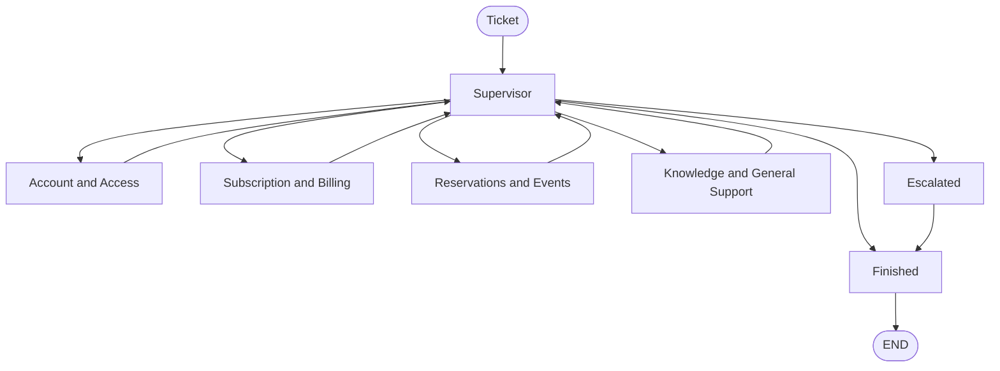

# Multi-Agent Customer Support

A multi-agent customer support system built with LangGraph. It handles support tickets for CultPass, a cultural experiences subscription app. A supervisor agent reads each ticket and routes it to one of four specialized agents. Each agent can resolve the ticket or escalate it to a human.

## Architecture

The whole graph is built by hand with LangGraph's `StateGraph`, not with a prebuilt orchestration helper. A Supervisor node reads each ticket and decides what happens next: route it to one of 4 specialized agents, mark it as finished, or escalate it to a human. Each specialized agent is a ReAct agent (`create_react_agent`).



**Input**: a ticket. This is a `ticket_id`, a starting message from the user, and the ticket's metadata already stored in the database (tags, status, creation date).

**Output**: one of two things.

1. A resolved ticket. The agent's answer is added to the conversation, and the ticket is marked as finished.
2. An escalated ticket. The ticket's status in the database is set to "escalated", with a short reason, and it waits for a human.

In both cases, the conversation is saved to the `TicketMessage` table.

### Agents

**Supervisor** — reads the conversation and the ticket metadata, and decides what to do next. It does not answer the user itself. One LLM call with structured output decides 3 things at once: is the ticket finished, does it need to escalate, and if not, which agent should handle it. Lives in `agentic/workflow.py`, since it is part of the orchestration graph, not a standalone agent.

**Account and Access** (`agentic/agents/account_agent.py`) — handles login problems, blocked accounts, and email changes. Uses `cultpass.User`. Tools: `get_user_status`, `update_user_email`, `get_user_ticket_history`, `escalate_to_supervisor`.

**Subscription and Billing** (`agentic/agents/subscription_agent.py`) — handles actions on a subscription: cancelling, pausing, and changing the tier. It does not answer questions about what a subscription includes, that goes to the Knowledge agent instead. Uses `cultpass.Subscription`. Tools: `update_subscription_status`, `update_subscription_tier`, `escalate_to_supervisor`. (`get_subscription_status` also exists as an MCP tool in `agentic/tools/cultpass_mcp_server.py`, but it is not connected to this agent yet.)

**Reservations and Events** (`agentic/agents/reservation_agent.py`) — handles browsing experiences, creating a reservation, and cancelling one. Uses `cultpass.Experience` and `cultpass.Reservation`. Tools: `list_available_experiences`, `create_reservation`, `cancel_reservation`, `escalate_to_supervisor`.

**Knowledge and General Support** (`agentic/agents/knowledge_agent.py`) — answers general questions using the knowledge base. This is the catch-all agent for anything that does not clearly belong to account, subscription, or reservation topics. Tools: `search_knowledge_base`, `escalate_to_supervisor`.

### Routing

The Supervisor routes based on two things together: the conversation content and the ticket metadata (tags, main issue type, how long it has been open).

Tags are a strong signal, but not always enough on their own. For example, a ticket tagged "subscription" could mean the user wants information (Knowledge agent) or wants to change something (Subscription agent). The Supervisor looks at the actual message to tell these two apart.

If a ticket has been open a long time without being resolved, the Supervisor treats that as high urgency and escalates instead of trying another agent.

### Knowledge Retrieval (RAG)

`search_knowledge_base` uses TF-IDF and cosine similarity (scikit-learn), not embeddings or a vector database. Each article's title, content, and tags are turned into a TF-IDF vector, and the search query is turned into a vector the same way. The result is a similarity score between 0 and 1 for each article.

This is keyword based search, not semantic search. It does not understand synonyms or paraphrasing the way an embedding model would, but unlike a plain SQL search, it does not need an exact word or phrase match either.

The Knowledge agent uses the top result's score to decide what to do:

- No articles found: escalate right away.
- Score below 0.25: treat it as noise, escalate instead of guessing.
- Score between 0.25 and 0.4: answer, but say the answer is not guaranteed to be correct.
- Score 0.4 or higher: answer with confidence.

### Memory

**Short term**: the graph is compiled with a `MemorySaver` checkpointer, keyed by `thread_id`. This keeps the conversation state during a single ticket, across multiple turns.

**Long term**: `persist_ticket_messages` saves every resolved conversation to the `TicketMessage` table, once the ticket is finished or escalated. `get_user_ticket_history` reads a user's past tickets back. The Account agent uses this tool to give more personalized answers, for example mentioning a similar issue the user had before.

### Escalation

Every agent shares the same `escalate_to_supervisor` tool. When an agent cannot resolve a ticket, it calls this tool and control goes back to the Supervisor. The Supervisor can then try a different agent, or, if nothing works, mark the ticket as escalated. Escalating updates `TicketMetadata.status` in the database, so the ticket is ready for a human to pick up.

### Logging

Every Supervisor decision, every tool an agent uses, and every escalation is logged as one JSON line in `agentic/logs/agent_events.jsonl`. Each line has a timestamp, the node that logged it, the ticket id, and details about what happened. This makes the full flow easy to inspect after the fact.

## Project Structure

- `data/models/`: SQLAlchemy models for the two databases (`cultpass.py`, `udahub.py`).
- `data/external/`: CultPass data — `cultpass.db`, plus the source files used to seed it (`cultpass_users.jsonl`, `cultpass_experiences.jsonl`, `cultpass_articles.jsonl`). Created by `01_external_db_setup.ipynb`.
- `data/core/`: Udahub's own database, `udahub.db` — tickets, accounts, and knowledge base. Created by `02_core_db_setup.ipynb`.
- `agentic/agents/`: the 4 specialized agents.
- `agentic/tools/`: tools used by the agents (database access, knowledge search, escalation, memory).
- `agentic/workflow.py`: the LangGraph orchestration graph, including the supervisor.
- `agentic/logs/`: structured logs written while the system runs.
- `tests/`: automated tests (pytest).
- `01_external_db_setup.ipynb`, `02_core_db_setup.ipynb`: notebooks to set up both databases.
- `03_agentic_app.ipynb`: notebook to run the system, including sample ticket demos.

## Getting Started

### Dependencies

- Python 3.12.3
- See `requirements.txt` for all packages.

### Installation

1. Create a virtual environment:
   ```
   python3 -m venv .venv
   source .venv/bin/activate
   ```
2. Install dependencies:
   ```
   pip install -r requirements.txt
   ```
3. Copy `.env.example` to `.env` and fill in your OpenAI API key (and, if you use a Vocareum key, the base URL it gave you):
   ```
   cp .env.example .env
   ```

### Setup

Run these notebooks once, in order, to create both databases:

1. `01_external_db_setup.ipynb`: creates `cultpass.db` with users, experiences, subscriptions, and reservations.
2. `02_core_db_setup.ipynb`: creates `udahub.db` with the account, the knowledge base, and a sample ticket.

### Running the App

Open `03_agentic_app.ipynb`. It:

- Loads the orchestrator from `agentic/workflow.py`.
- Runs an interactive chat with `chat_interface`.
- Includes 3 sample tickets that show the system resolving a request through the knowledge, reservation, and subscription agents, without escalating.

## Testing

Run the test suite from the project root:

```
pytest
```

The tests cover the 9 tools (database access, knowledge search, escalation, memory) and the structured logging. They run against the real `cultpass.db` and `udahub.db` files and clean up after themselves. They require no API key, so they also run in CI on every push (see `.github/workflows/tests.yml`).

## Running with Docker

The project ships with a `Dockerfile` and `docker-compose.yml` covering two independent use cases. Neither one runs the notebooks automatically — pick the one you need.

**Run the automated tests** (no `.env` needed, this is also what CI runs):

```
docker compose run --rm tests
```

This builds the image, runs `pytest` inside the container, and prints the results to your terminal. Nothing stays running afterwards.

**Explore the notebooks interactively** (requires a `.env` file, see `.env.example`):

```
docker compose up app
```

This starts a Jupyter Lab *server* inside the container, exposed at [http://localhost:8888](http://localhost:8888). Open that URL, then open and run `03_agentic_app.ipynb` yourself, cell by cell, exactly as you would locally — the container just saves you from installing Python/dependencies on your machine. It does not execute any notebook or open any output on its own.

## Built With

- [LangGraph](https://www.langchain.com/langgraph): the orchestration graph.
- [LangChain](https://www.langchain.com/): agent and tool framework.
- [FastMCP](https://gofastmcp.com/): MCP server for the subscription status tool.
- [SQLAlchemy](https://www.sqlalchemy.org/): database models and queries.
- [scikit-learn](https://scikit-learn.org/): TF-IDF search for the knowledge base.
- [pytest](https://pytest.org/): automated tests.
- [Docker](https://www.docker.com/): containerized tests and app.

## License

This project is licensed under the MIT License — see [LICENSE](LICENSE) for details.
