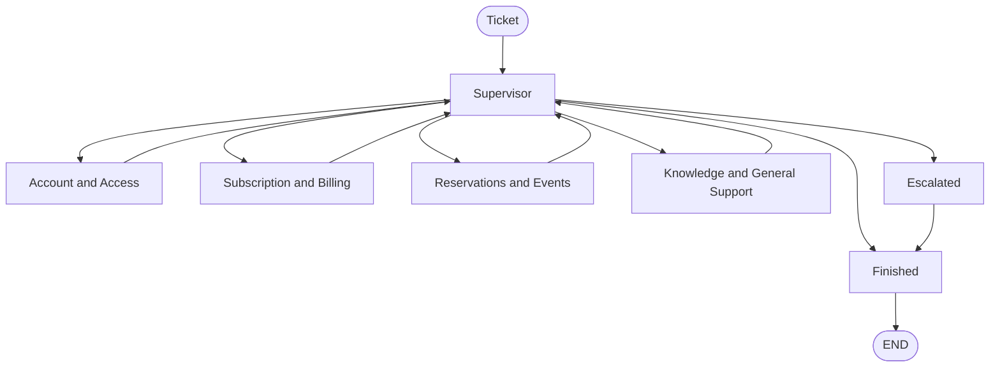

# Agentic Architecture

This system uses a supervisor pattern. A Supervisor node reads each ticket and decides what happens next. It can route the ticket to one of 4 specialized agents, mark it as finished, or escalate it to a human.

The whole graph is built by hand with LangGraph's `StateGraph`, not with a prebuilt orchestration helper. Each specialized agent is a ReAct agent (`create_react_agent`). This is allowed since the "no prebuilt workflow" rule applies to the orchestration graph, not to individual agents.

## Graph Structure

## Input and Output

**Input**: a ticket. This is a `ticket_id`, a starting message from the user, and the ticket's metadata already stored in the database (tags, status, creation date).

**Output**: one of two things.

1. A resolved ticket. The agent's answer is added to the conversation, and the ticket is marked as finished.
2. An escalated ticket. The ticket's status in the database is set to "escalated", with a short reason, and it waits for a human.

In both cases, the conversation is saved to the `TicketMessage` table.

## Agents

### Supervisor

Reads the conversation and the ticket metadata, and decides what to do next. It does not answer the user itself. One LLM call with structured output decides 3 things at once: is the ticket finished, does it need to escalate, and if not, which agent should handle it.

### Account and Access Agent

Handles login problems, blocked accounts, and email changes. Uses `cultpass.User`.

Tools: `get_user_status`, `update_user_email`, `get_user_ticket_history`, `escalate_to_supervisor`.

### Subscription and Billing Agent

Handles actions on a subscription: cancelling, pausing, and changing the tier. It does not answer questions about what a subscription includes, that goes to the Knowledge agent instead. Uses `cultpass.Subscription`.

Tools: `update_subscription_status`, `update_subscription_tier`, `escalate_to_supervisor`.

`get_subscription_status` also exists as an MCP tool (`agentic/tools/cultpass_mcp_server.py`), but it is not connected to this agent yet.

### Reservations and Events Agent

Handles browsing experiences, creating a reservation, and cancelling one. Uses `cultpass.Experience` and `cultpass.Reservation`.

Tools: `list_available_experiences`, `create_reservation`, `cancel_reservation`, `escalate_to_supervisor`.

### Knowledge and General Support Agent

Answers general questions using the knowledge base. This is the catch all agent for anything that does not clearly belong to account, subscription, or reservation topics.

Tools: `search_knowledge_base`, `escalate_to_supervisor`.

## Routing

The Supervisor routes based on two things together: the conversation content and the ticket metadata (tags, main issue type, how long it has been open).

Tags are a strong signal, but not always enough on their own. For example, a ticket tagged "subscription" could mean the user wants information (Knowledge agent) or wants to change something (Subscription agent). The Supervisor looks at the actual message to tell these two apart.

If a ticket has been open a long time without being resolved, the Supervisor treats that as high urgency and escalates instead of trying another agent.

## Knowledge Retrieval (RAG)

`search_knowledge_base` uses TF-IDF and cosine similarity (scikit-learn), not embeddings or a vector database. Each article's title, content, and tags are turned into a TF-IDF vector, and the search query is turned into a vector the same way. The result is a similarity score between 0 and 1 for each article.

This is keyword based search, not semantic search. It does not understand synonyms or paraphrasing the way an embedding model would, but unlike a plain SQL search, it does not need an exact word or phrase match either.

### Confidence Scoring

The Knowledge agent uses the top result's score to decide what to do:

- No articles found: escalate right away.
- Score below 0.25: treat it as noise, escalate instead of guessing.
- Score between 0.25 and 0.4: answer, but say the answer is not guaranteed to be correct.
- Score 0.4 or higher: answer with confidence.

## Memory

**Short term**: the graph is compiled with a `MemorySaver` checkpointer, keyed by `thread_id`. This keeps the conversation state during a single ticket, across multiple turns.

**Long term**: `persist_ticket_messages` saves every resolved conversation to the `TicketMessage` table, once the ticket is finished or escalated. `get_user_ticket_history` reads a user's past tickets back. The Account agent uses this tool to give more personalized answers, for example mentioning a similar issue the user had before.

## Escalation

Every agent shares the same `escalate_to_supervisor` tool. When an agent cannot resolve a ticket, it calls this tool and control goes back to the Supervisor. The Supervisor can then try a different agent, or, if nothing works, mark the ticket as escalated. Escalating updates `TicketMetadata.status` in the database, so the ticket is ready for a human to pick up.

## Logging

Every Supervisor decision, every tool an agent uses, and every escalation is logged as one JSON line in `agentic/logs/agent_events.jsonl`. Each line has a timestamp, the node that logged it, the ticket id, and details about what happened. This makes the full flow easy to inspect after the fact.
